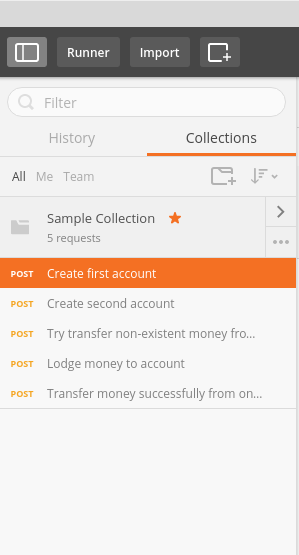

# Automated postman tests and database query assertions.

This repository is a boundary testing framework based on Postman collections. It achieves a full boundary testing scenario where you can automatically test your application frontend and assert that correct values are inserted into the database. The current oslution uses Postman's Newman collection runner and a simple CSV file matching to achieve its results. 
The boundary testing framework exports results in JUnit format and therefore can be simply plugged in to a Jenkins instance or other CI tool for automated continuous integration functional testing. You can create multiple test scenarios that can contain multiple test cases. These test cases can be labeled with tags to achieve different runs for different test needs. 

To run ```node testRunner.js [--tags=comma,separated,list] [--silent]```

Run options:
 1. tags -> set up tags in your test scenario and run only matching tags
 2. silent -> don't log into console, log into a log file

## Installation instructions


### Folder structure
```
scenario_runner
│   README.md                 --- This file
│   package.json              --- Project dependencies and info
│   properties.json           --- Database connections strings 
│   testRunner.js             --- Main test runner
│
└───lib
│   │   db.js                 --- DB assertion checks
│   │   postmanEnvironment.js --- Postman environment builder
│   │   postgresManager.js    --- Simple wrapper to run queries against PostgreSQL DB
│   
└───scenarios
│   └───sample
│       │   collection.json   --- Your exported Postman Collection
│       │   testdata.json     --- Your test scenario settings file
│       │   [dbSetup.sql]     --- Optional (optional name) DB script to set database initial state
│       │   [dbTearDown.sql]  --- Optional (optional name) DB script to tear down database state after all tests in scenario are run
│       │   [dbQuery.sql]     --- Optional (optional name) DB query to retrieve DB state after test case in scenario has been run
│       │   [dbExpected.csv]  --- Optional (optional name) CSV file with expected results of DB query defined above
│       │   [test-report.xml] --- JUnit report of the testcase(s)
│       │   [testcase.log]    --- Log output of this particular scenario

```

### Setup

Database settings are located in properties.json. Currently on PostgreSQL is supported but since the whole DB query structure is so simple, it is trivial to add other DB vendors.

Scenarios folder contains your test scenarios. Each Scenario is its own folder and they are distinguished from each other by the folder name. 
Each scenario needs to have a Postman `collection.json` file and a `testdata.json`. Collection files are exported from Postman and can contain multiple steps. 

Testdata.json contains all your different test cases for this particular scenario. All test cases defined in this file use the same Postman collection file. 
Example testdata.json is attached:

```json
{
  "setup": "dbSetup.sql",
  "tearDown": "dbTearDown.sql",
  "testCases": [
    {
      "tags": [
        "nightly"
      ],
      "name": "Test1",
      "variables": {
        "account_from": "1",
        "account_to": "2",
        "transfer_amount": "42"
      },
      "assertions": {
        "first_transfer_status": false,
        "second_transfer_status": true
      },
      "db": [
        {
          "variables": {
            "accountId": 1
          },
          "query": "dbQuery.sql",
          "results": "dbExpected.csv"
        }
      ]
    }
  ]
}
```
#### Fields

1. setup -> The name of a DB setup script that is in the same scenario folder. This is run once before the scenario is executed. Can be used to initialize database state to wanted values.
2. tearDown -> The name of a DB tear down script that is in the same scenario folder. This is run once after the scenario is executed. Can be used to reset DB to its original state
3. testCases -> A collection of test case objects:
    * tags -> An array of strings that can be used as tags. E.g. `nightly`, `smoke-test` etc.
    * name -> Name of this individual test case
    * variables -> an object containing variables. These variables will be swapped to your Postman variable places. See Postman help to set up variables correctly (use `{{variable_name}}` in your form/url/requestbody/json).
    * assertions -> an object containing variables that can be changes for Postman test case assertions. These are replaced to represent your Postman test assertions. See [Postman Docs](https://www.getpostman.com/docs/testing_examples) for more. (Use `getEnvironmentVariable("variable_name")` in your test assertions).
    * db -> An array containing your test cases db setup objects
        * variables -> key-value pairs that are swapped to your query. Use `${variable_name}` as your query place holder
        * query -> name of the query file
        * results -> Expected results of the query as a CSV file
      
### Running 

```
npm install
```

```
npm start
```

You can use https://github.com/Xantier/bank-application as a test bench to see if this wrapper is useful for you purposes. 
The sample test case has 5 steps in its Postman collection. It creates 2 accounts. Tries to transfer money from one account to another and fails. Lodges some money into that account and then successfully transfers that money to another account. The Boundary testcase contains a DB setup script that empties the full database. Runs this Postman collection with few chosen variables and checks that responses from the application are what is expected. Checks the database that correct results have been saved into the DB and finally tears down the database.

# License


[The MIT License](http://opensource.org/licenses/mit-license.php)


### Creating Postman test cases and collections

Create your Postman test cases and environment for them.
 


Run the collection manually with your environment set up.
 


Export them as a collection.
 



